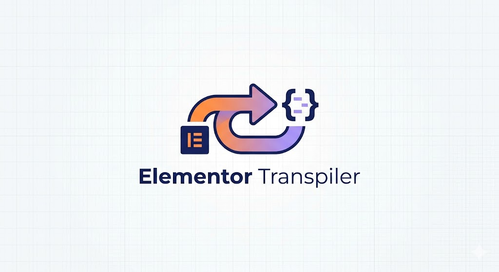

<p align="center">
  
</p>

<h1 align="center">elementor-transpiler</h1>

<p align="center">
  <a href="https://skills.sh/santi1475/elementor-transpiler">
    
  </a>
  &nbsp;
  
</p>

<p align="center">
  Converts <strong>Elementor (WordPress)</strong> pages into clean, modern, and production-ready frontend code.
</p>

---

## What does it do?

It takes the Elementor export JSON and transpiles it into real code matching your stack:

| Input | Output |
|---|---|
| Elementor JSON | HTML5 / Vanilla CSS3 |
| Elementor JSON | Astro (Island Architecture) |
| Elementor JSON | Next.js + React + Tailwind |
| Elementor JSON | Vite + React + Tailwind |

The skill automatically detects your project environment by reading `package.json`, `astro.config.mjs`, or `tailwind.config.js`. If none are found, it generates pure HTML/CSS.

### Features Included

- **Semantic structure** — eliminates Elementor's "divitis" by using `<section>`, `<article>`, `<nav>`, `<header>`, `<footer>`
- **Color system** — extracts all hex codes and creates CSS variables (`:root`) or extends your Tailwind configuration
- **Full typography styling** — handles Google Fonts, typographic scales, px-to-rem conversion, and responsive scaling using `clamp()`
- **Animations** — maps over 40 Elementor entrance animations to native `@keyframes` + Intersection Observer (without heavy libraries) or Framer Motion for React
- **Responsiveness** — translates Elementor breakpoints into native media queries or Tailwind prefixes
- **Glassmorphism and overlays** — handles `backdrop-filter`, gradients, and background overlay layers using `::before`
- **Third-party widgets** — generates commented skeletons for plugins like Essential Addons, JetElements, etc.

---

## Installation

```bash
npx skills add santi1475/elementor-transpiler
```

Compatible with **Claude Code**, **Cursor**, **Windsurf**, **Codex**, **GitHub Copilot**, **Roo Code**, **Cline**, and [over 50 agents](https://skills.sh).

### Install only for Claude Code

```bash
npx skills add santi1475/elementor-transpiler -a claude-code
```

### Install globally (for all your projects)

```bash
npx skills add santi1475/elementor-transpiler -g
```

---

## Usage

### 1. Export your Elementor page

In WordPress, navigate to: **Elementor → Tools → Export/Import Template**, or use the REST API endpoint:

```
/wp-json/elementor/v1/export/templates/{id}
```

Alternatively, you can copy the raw JSON directly from: **Elementor → Panel → `</>` button (Edit Raw JSON)**

### 2. Open your agent with the skill installed

Paste the JSON into the chat and write something like:

```
Convert this Elementor JSON to Astro
```

```
Migrate this Elementor page to Next.js with Tailwind
```

```
Transform this JSON into clean, vanilla HTML/CSS
```

The skill will automatically detect your project's framework. If it cannot determine it, it will ask.

### 3. Result

You will receive code organized by files, featuring:
- Centralized CSS variables
- Animations powered by Intersection Observer (no jQuery, no WOW.js)
- Images configured with `loading="lazy"` and placeholder paths ready for replacement
- Clear comments where third-party widgets require manual implementation

---

## Example

**Input (Elementor JSON snippet):**
```json
{
  "elType": "section",
  "settings": {
    "background_color": "#1a1a2e",
    "animation": "fadeInUp",
    "animation_duration": "slow"
  },
  "elements": [
    {
      "elType": "widget",
      "widgetType": "heading",
      "settings": {
        "title": "Transform your business",
        "typography_font_family": "Poppins",
        "typography_font_size": { "unit": "px", "size": 52 },
        "color": "#e94560"
      }
    }
  ]
}
```

**Output (Vanilla HTML/CSS):**
```html
<!-- === HERO SECTION === -->
<section class="hero" data-animate="fadeInUp">
  <div class="container">
    <h1 class="hero__title">Transform your business</h1>
  </div>
</section>
```
```css
:root {
  --color-bg-dark: #1a1a2e;
  --color-primary: #e94560;
  --font-heading: 'Poppins', sans-serif;
  --text-5xl: clamp(2rem, 5vw, 3.25rem);
  --animation-duration-slow: 1.2s;
}

.hero {
  background: var(--color-bg-dark);
  padding-block: var(--spacing-section);
}

.hero__title {
  font-family: var(--font-heading);
  font-size: var(--text-5xl);
  color: var(--color-primary);
}
```

---

## Supported Frameworks

| Framework | Auto-detection | Output |
|---|---|---|
| Vanilla HTML5 / CSS3 | No configuration files | `index.html` + `css/` and `js/` directories |
| Astro | `astro.config.mjs` | `.astro` components + `global.css` |
| Next.js + Tailwind | `next.config.js` + `tailwind.config` | `.tsx` components + App Router structure |
| Vite + Tailwind | `vite.config.js` + `tailwind.config` | React/Vue components |

---

## Skill Structure

```
skills/
└── elementor-transpiler/
    ├── SKILL.md                    ← Main agent instructions
    └── references/
        ├── animation-map.md        ← 40+ animations mapped + code templates
        ├── color-system.md         ← Color extraction, gradients, glassmorphism
        ├── typography-map.md       ← Google Fonts, typographic scales, responsive scaling
        └── target-frameworks.md   ← Framework-specific guides + accessibility checklist
```

---

## Contributing

Pull Requests are welcome. Areas with opportunities for improvement:

- Support for more Elementor Pro widgets
- Elementor global kit theme mapping
- Vue 3 / Nuxt support as output targets
- More animations from plugins like Elementor-integrated GSAP

Please open an issue before submitting a large PR to align on the approach.

---

## License

[MIT](LICENSE.md)
